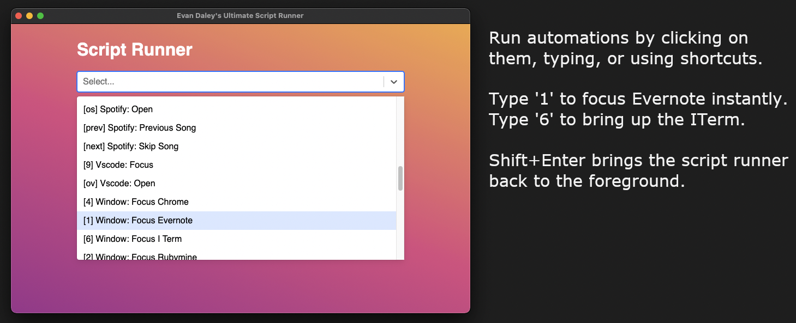

## Usage

This project makes it easy to write automation scripts on mac, and trigger them with a minimal amount of keystrokes. I use it to set custom window configurations, open specific slack conversations, control music, open bookmarked pages, open specific apps, jump straight to display settings, etc etc.

Workflow:
1. Create and edit your automations in the applescripts folder.
2. Boot up the app with `yarn start`.
3. Start typing the name of a command and hit enter. Boom! The automation will run.
4. You can speed up your workflow even more by using shortcuts. Typing the shorcut characters will immediately run the script. Shortcuts are listed inside brackets at the beginning of a command. 




Other info:
- To go really fast, use "shift + enter" to focus the app, and customize the shortcut keys (in brackets) to trigger scripts instantly. No need to touch the mouse or type extra keys.
- Refresh the app with command + r (to reload applescript files).
- To edit shortcuts, see src/inputMappings.ts

Its pretty magical when you use the keyboard shortcuts. 
- "shift + enter" to focus the app, then 1 to open evernote
- "shift + enter" and 9 to focus VS Code
- you can bind the really important/frequent stuff to shortcuts on the home row.
 
## Install Dependencies
```bash
yarn
```

## Starting Development

Start the app in the `dev` environment:

```bash
yarn start
```

## Packaging for Production

To package apps for the local platform:

```bash
yarn package
```
